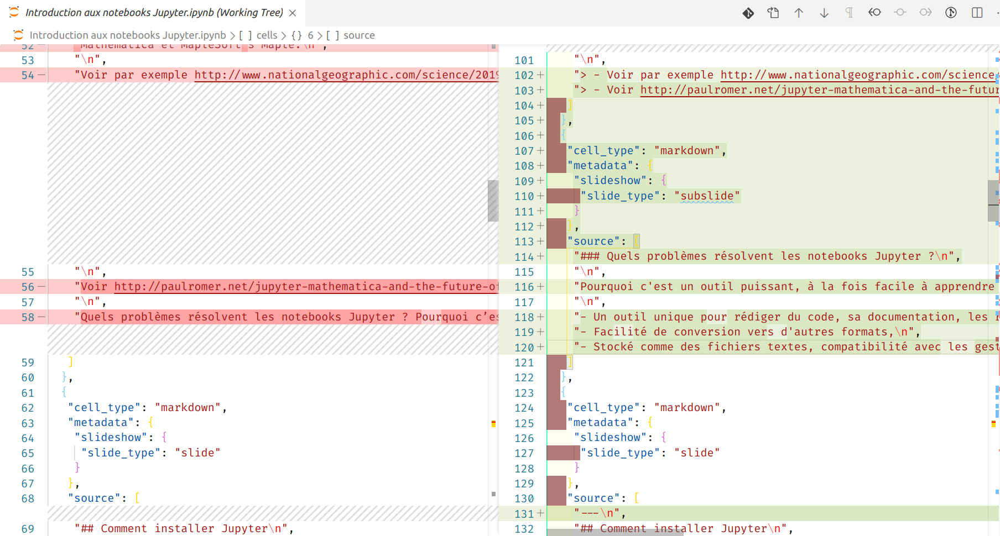
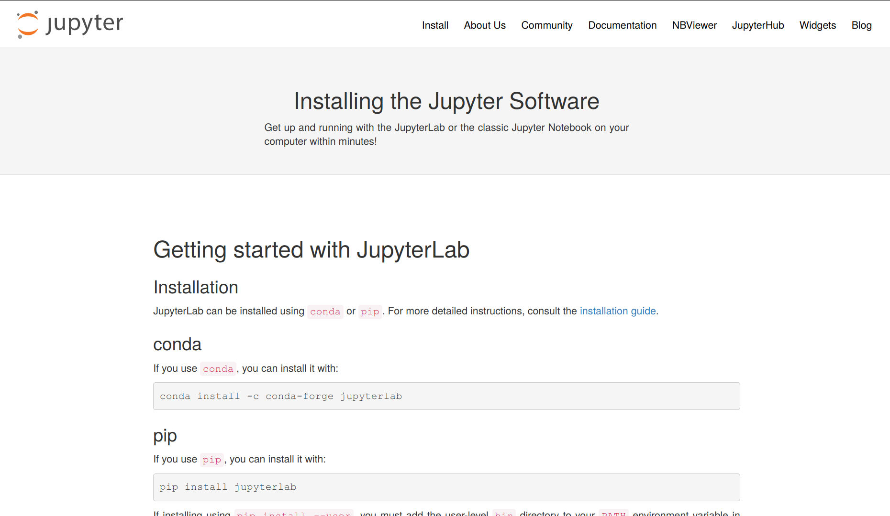
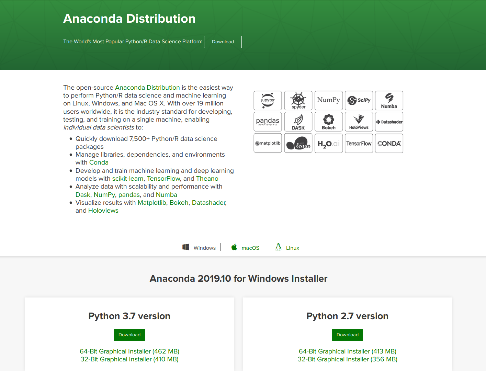
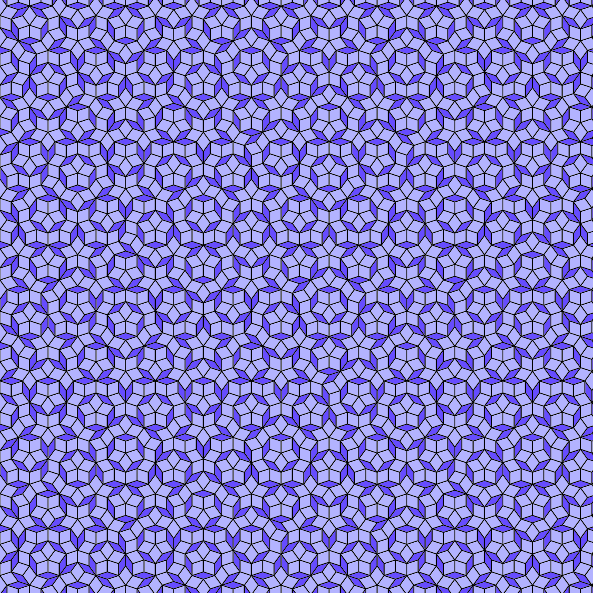
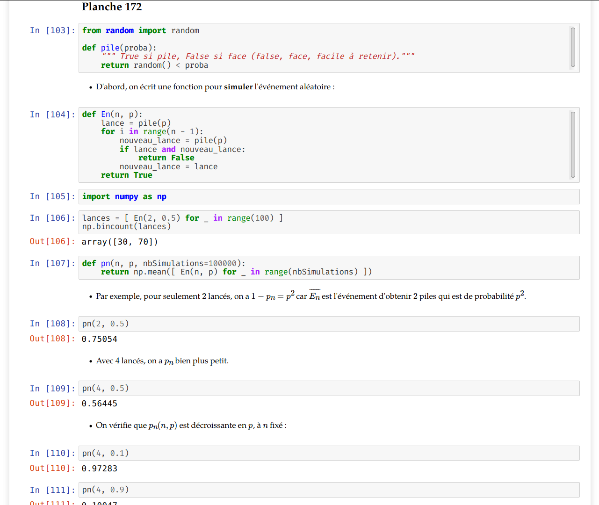
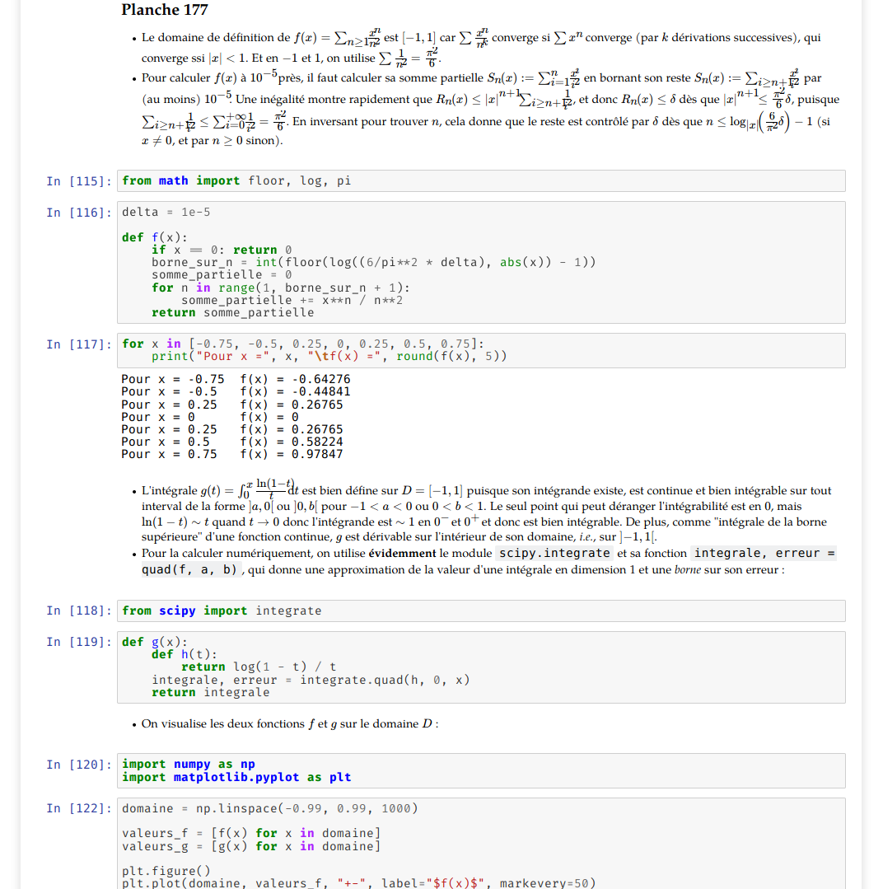
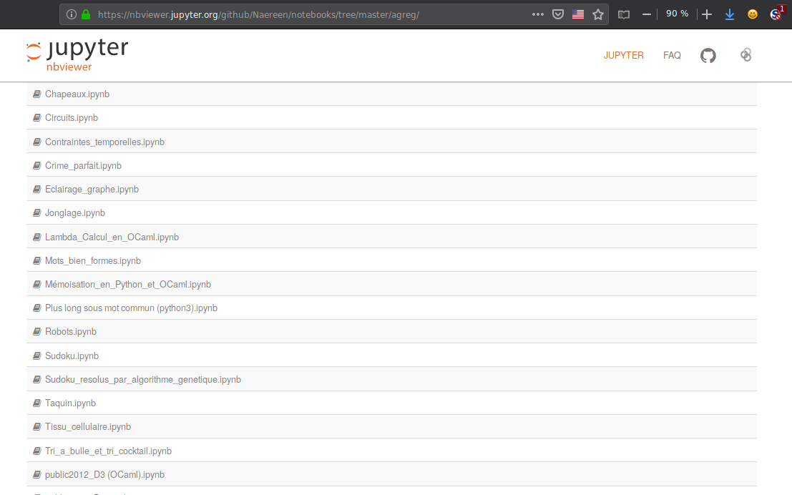
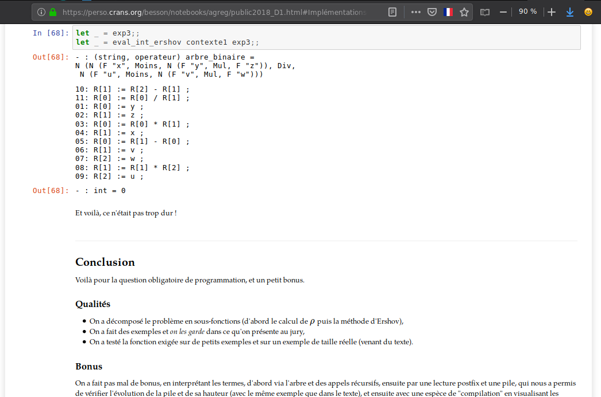
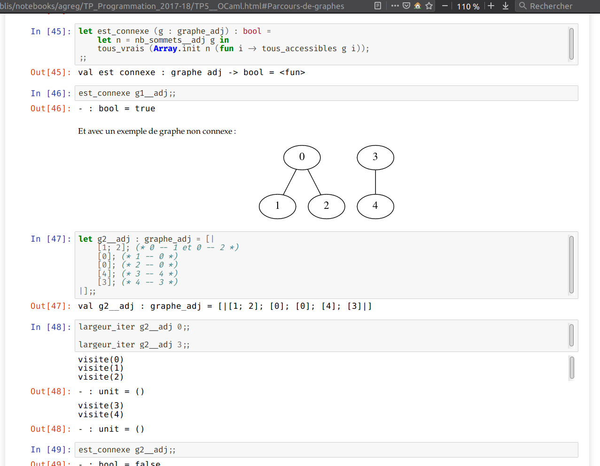
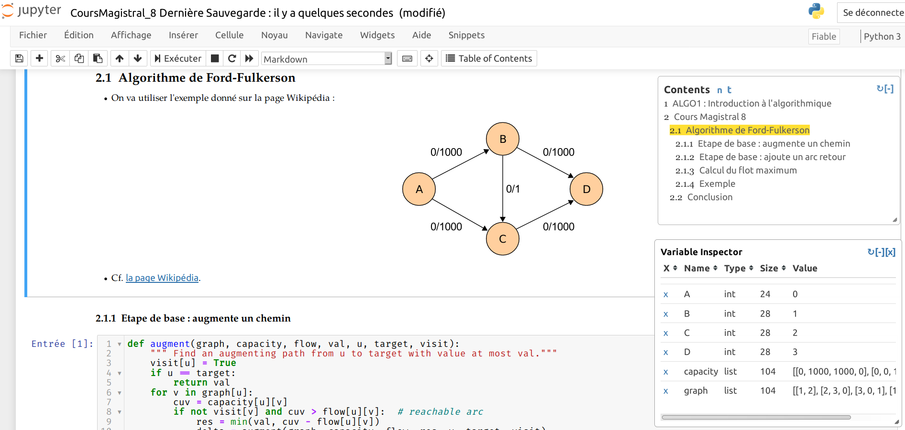

# Tutoriel-notebooks-Jupyter-a-Didapro-8-Lille-fevrier-2020
Introduction aux notebooks Jupyter

Ce tutoriel durera 55 minutes, durant la journée de mercredi 05 février, à la [conférence Didapro 8](https://www.didapro.org/8/programme/#atelier), à Lille.

- Suivez d'abord la présentation, puis il y a aura une activité à faire par vous même, avant de terminer par plusieurs démonstrations.

- Ces ressources sont disponibles en ligne sur [`frama.link/Atelier-Jupyter-Didapro8`](https://frama.link/Atelier-Jupyter-Didapro8)

## Présentation de Jupyter

- Qu'est-ce que Jupyter ?
- Qu'est-ce qu’un notebook Jupyter ?
- Qu'est-ce que l’écosystème Jupyter ?
- Quels problèmes résolvent les notebooks Jupyter ?

### Qu’est-ce que Jupyter ?

Un environnement de développement intégré (IDE) "WYSIWYG" (What-you-see-is-what-you-get) pour (presque) tous les langages de programmation, que l'on utilise depuis un navigateur Internet.

Par exemple, il peut être utilisé pour des langages dynamiques interprétés, tels que Python, OCaml, Julia ou Bash, mais aussi pour des langages compilés, tels que C/C++ etc.

C'est un ensemble de logiciels libres et gratuits, installables sur n'importe quel ordinateur moderne et qui sont faciles à prendre en main.

### Qu’est-ce qu’un notebook Jupyter ?

C'est un fichier, à l'extension `.ipynb` (*ipy*thon *n*ote*b*ook), qui est un format de texte brut de type [JSON](https://www.json.org/).

Ce fichier peut être converti en présentation (slide show) comme celle utilisée aujourd'hui, en page web statique (HTML), en document prêt à être imprimé (PDF), en script (Python ou autre)

Le format de fichier, et tous les logiciels de l'environnement Jupyter, sont gratuits et sous licence libre, comme Python.

Un document contient des cellules de texte (en Markdown ↑), et de code ↓.


```python
!file "Introduction aux notebooks Jupyter.ipynb"
!head "Introduction aux notebooks Jupyter.ipynb"
!grep "texte brut" "Introduction aux notebooks Jupyter.ipynb" | head -n1
```

    Introduction aux notebooks Jupyter.ipynb: HTML document, UTF-8 Unicode text, with very long lines
    {
     "cells": [
      {
       "cell_type": "markdown",
       "metadata": {
        "slideshow": {
         "slide_type": "skip"
        },
        "toc": "true"
       },
        "C'est un fichier, à l'extension `.ipynb` (*ipy*thon *n*ote*b*ook), qui est un format de texte brut de type [JSON](https://www.json.org/).\n",


### Qu'est-ce que l’écosystème Jupyter ?
Il a commencé sous le nom ipython il y a environ 15 ans, conçu pour être utilisé uniquement pour le langage de programmation Python, et de nos jours il a évolué en un écosystème open-source mature.

*Jupyter* est nommé d'après Jupiter, et pour *Ju*lia, *pyt*hon, et *R*, les trois premiers langages pour lesquels Jupyter était disponible.

Il est utilisé par des centaines de milliers de scientifiques du monde entier, allant d'étudiants au lycée, en prépa et à l'université en France et ailleurs, aux meilleures équipes utilisant les sciences des données et du numérique.

Les notebooks Jupyter sont une alternative gratuite et open-source à l’EDI inclus dans les logiciels propriétaires et payants qui dominent le marché, comme MATLAB, Wolfram's Mathematica et MapleSoft's Maple.

Parmi ses récentes utilisations réussies, on peut noter la toute première image d’un trou noir obtenue par Katie Bouman et ses collaborateurs, ou pour l'analyse de données par des lauréats de prix Nobel, comme Paul Romer.

- Voir par exemple http://www.nationalgeographic.com/science/2019/04/first-picture-black-hole-revealed-m87-event-horizon-telescope-astrophysics/ et http://www.bbc.com/news/science-environment-47891902.
- Voir http://paulromer.net/jupyter-mathematica-and-the-future-of-the-research-paper/

### Quels problèmes résolvent les notebooks Jupyter ?

Pourquoi c'est un outil puissant, à la fois facile à apprendre et à utiliser pour les débutants et puissant pour les utilisateurs experts.

- Un outil unique pour rédiger du code, sa documentation, les résultats de l'exécution du code, des figures etc,
- Facilité de conversion vers d'autres formats (scripts, HTML, PDF etc),
- Stocké comme des fichiers textes, compatibilité avec les gestionnaires de version tels que `git`.

<center></center>

---
## Comment installer Jupyter

En suivant le tutoriel en ligne depuis https://jupyter.org/install.html, il est facile d’installer tout l’écosystème Jupyter sur tout ordinateur avec Python et pip ou conda installés.

<center></center>

Sur Windows ou Mac OS X, ou même la plupart des systèmes GNU/Linux, un installeur gratuit appelé Anaconda (https://www.anaconda.com/distribution/) installe tout ça en un clic !

<center></center>

## Comment utiliser Jupyter pour écrire des documents simples

Je vais vous montrer l'interface utilisateur graphique des notebooks Jupyter, et nous allons voir ensemble comment éditer des cellules de texte ou de code, et exécuter des cellules.

Ceci est une cellule de texte. On peut *utiliser* [Markdown](http://commonmark.org/) ! Et $\LaTeX$

|-


```python

```

---
## Des exemples en Python

1. Premier contact avec Python,
2. Manipulation de tableaux numpy et affichage avec Matplotlib,
3. Widgets interactifs avec `ipywidgets`,
4. Un exemple plus impressionnant : pavage de Penrose.

### Premier contact avec Python

Deux exemples d'utilisation de Python, venant de la page d'accueil du site https://www.python.org/ :


```python
nombres = [2, 4, 6, 8]
produit = 1
for nombre in nombres:
    produit *= nombre

print("Le produit de ces", len(nombres), "nombres est", produit)
```

    Le produit de ces 4 nombres est 384


```python
import datetime

print("Date actuelle :")
print(datetime.datetime.now())
```

    Date actuelle :
    2020-01-29 17:40:30.384708


```python
def fib(n):
    """ Affiche les premières valeurs de la suite de Fibonacci <= n."""
    a, b = 0, 1
    while a < n:
        print(a, end=' ')
        a, b = b, a+b
    print()

fib(1000)
```

    0 1 1 2 3 5 8 13 21 34 55 89 144 233 377 610 987 


Depuis un notebook Jupyter, la documentation de n'importe quelle valeur peut être affichée avec la touche tab, ou en utilisant :


```python
fib?
```

### Manipulation de tableaux numpy et affichage avec Matplotlib

Cet exemple est tiré d'un exercice d'oral de CentraleSupélec pour PSI (166 officiel de la Taupe 2019).

Sur un plateau style Monopoly à 12 cases, un pion part de la case 0, et on joue au dé (à 6 faces) pour avancer à chaque coup de $x$ case (où $x\sim\mathcal{U}(1,\dots,6)$.

L'exercice demande de simuler la variable aléatoire $Y_n$ représentant la case sur laquelle le pion se trouve après $n$ déplacements.


```python
import numpy as np
import numpy.random as rd

import matplotlib.pyplot as plt
import seaborn as sns
sns.set(context="notebook", style="whitegrid", palette="hls", font="sans-serif", font_scale=1.3)
```


```python
case_max = 12
univers = list(range(case_max))

def prochaine_case(case):
    return (case + rd.randint(1, 6+1)) % case_max

def Yn(duree, depart=0):
    case = depart
    for coup in range(duree):
        case = prochaine_case(case)
    return case
```

Avant de s'en servir pour simuler plein de trajectoirs, on peut vérifier que en un coup, on avance pas plus de 6 cases :


```python
[Yn(1) for _ in range(10)]
```


    [4, 4, 6, 6, 1, 6, 2, 1, 4, 5]


On peut ensuite réaliser des histogrammes des 12 valeurs possibles pour $Y_n$, avec par exemple 10000 répétitions iid.


```python
def histogramme(duree, repetitions=10000):
    cases = [Yn(duree) for _ in range(repetitions)]
    frequences = np.bincount(cases, minlength=case_max)
    # aussi a la main si besoin
    frequences = [0] * case_max
    for case in cases:
        frequences[case] += 1
    return frequences / np.sum(frequences)
```


```python
n = 0
plt.figure(figsize=(10,7))
plt.bar(np.arange(case_max), histogramme(n))
plt.title("Histogramme de cases visitées en " + str(n) + " coups")
plt.show()
```


    <Figure size 720x504 with 0 Axes>


    <BarContainer object of 12 artists>


    Text(0.5, 1.0, 'Histogramme de cases visitées en 0 coups')


```python
n = 1
plt.figure(figsize=(10,7))
plt.bar(np.arange(case_max), histogramme(n))
plt.title("Histogramme de cases visitées en " + str(n) + " coups")
plt.show()
```


    <Figure size 720x504 with 0 Axes>


    <BarContainer object of 12 artists>


    Text(0.5, 1.0, 'Histogramme de cases visitées en 1 coups')


```python
n = 10
plt.figure(figsize=(10,7))
plt.bar(np.arange(case_max), histogramme(n))
plt.title("Histogramme de cases visitées en " + str(n) + " coups")
plt.show()
```


    <Figure size 720x504 with 0 Axes>


    <BarContainer object of 12 artists>


    Text(0.5, 1.0, 'Histogramme de cases visitées en 10 coups')


```python
n = 500
plt.figure(figsize=(10,7))
plt.bar(np.arange(case_max), histogramme(n))
plt.title("Histogramme de cases visitées en " + str(n) + " coups")
plt.show()
```


    <Figure size 720x504 with 0 Axes>


    <BarContainer object of 12 artists>


    Text(0.5, 1.0, 'Histogramme de cases visitées en 500 coups')


Cela montre qu'avec une trajectoire assez longue, le pion a une probabilité identique de terminer sur chaque position.

###  Widgets interactifs avec `ipywidgets`


```python
%matplotlib notebook
from ipywidgets import *
import numpy as np
import matplotlib.pyplot as plt

x = np.linspace(0, 2 * np.pi)
fig = plt.figure()
ax = fig.add_subplot(1, 1, 1)
line, = ax.plot(x, np.sin(x))

def update(w = 1.0):
    line.set_ydata(np.sin(w * x))
    fig.canvas.draw()

interact(update);
```


    <IPython.core.display.Javascript object>


<img src="data:image/png;base64,iVBORw0KGgoAAAANSUhEUgAAAgYAAAFZCAYAAADjD+cfAAAgAElEQVR4nO3daXRc9ZkmcIXpTCCd6aTT0zOZOd2Tdd73lsr2gVGfcZSmJ+rudHfImT5n5iSZMmsZb+ANsI3xChZrzJawJSEkBEIIgQRoFpvN7JuxLbxgvF7tkhfJq/a17jMfSmWE0FJVulX3vqXnd8794FLVvc+rv3z9+KqWoiIiIiIiIiIiIiIiIiIiIiIiIiIiIiIiIiIiIiIiIiIiIiIiIiIiIiIiIiIiIiIiIiIiIiIiIiIiIiIiIiIiIiIiIiIiIiIiIiIiIiIiIiIiIiIiIiIiIiIiIiIiIiIiIiIiIiIiIiIiIiIiIiIiIiIiIiIiIiIiIiIiIiIiIiIiIiIiIiIiIiIioiLXdT9TUVFxdkVFxde3bdv2FW7cuHHjNvZWUVHx9YqKirNd1/1M0OdxIl8NlAJw48aNG7estrODPo8T+aoi2XrR2tqK7u7ujLeKioqsHhemzfoM1vMXwgzMH/yW7xlaW1tTxeDrQZ/HiXw1cEkM3d3dyEZFRUVWjwsT6zNYzw/Yn4H5g5fvGVJlZNu2bV8J+jxO5CsWA/szWM8P2J+B+YPHYkATQllZ2ekisktVvzvSfaZMmfJXIrJeVdtFpEpVz8/kGCwG9mewnh+wPwPzB4/FgApeSUnJZ0XkWRHBaMVAVbeIyJPRaLTYcZxLVLXHcZxvpXscFgP7M1jPD9ifgfmDx2JABc1xnBIR2SUi20YrBpFI5H+pas+ZZ575hdRtIvKAqj6a7rFYDOzPYD0/YH8G5g8eiwEVNFW9SlVvKS0tPWO0YiAiy1V1y5DHXqyqdekei8XA/gzW8wP2Z2D+4LEY0IQxRjG4W1WfHnLbOSLSn+7+WQxyP0N/aws6dn2Ajl0foKumGr1Nh9Hf3gYvkfBl/1yD4DF/8FgMaMIYrRio6v2q+tiQ2/5BRFBWVvYn6ew/VQy4+bO9/+Yb2P7Hx7DzZ3dh97WrsG/+LLjx2LDb/ngM++dchD3LF+ODX96L9199JfD83Lhxy2xjMaC8G60YOI5zj6o+NeT+56hqT7r75xWD8c/geR469+7GgZ/c8tE//NOnoXbZIhz6+Z04/twz6PjwA3Tu2YW297eg5c3XcOKFdTj6xGNofuh+1K2+6tTj6stX4vi6p9Bz+FDe8oeB9RmYP3j5noFXDCgwYz3HQEQ2Db5NVWeoak26+2cxyH4GL5FA26aNqL92Jdx4DFXzZ+Ho44+ic98eJDo7M9pXz+FDOL7uKdSXr/yoJFy7Cp379uQsf5hYn4H5g8diQBPGGFcMvi0iXVOnTv2zQfd/QFV/l+7+WQwynyHR04MTG55HzZUL4cZjqL3qcpx85SUksvweDtV7pBnHn1+HmkVz4cZjOPTzO9F79MiI95+IaxA2zB88FgOaMIYWg7POOusvo9Ho54qKiorKy8tPG3hJ47ORSGSS4zhzRKQ7Eol8M939sxhkNkN3fS3qVl0JNx5Dw/VXo61ik29PIhwq0d2Fo088hspZF6By9kU49tTjSPT0fOJ+E20Nwoj5g8diQBPG0GKgqrWO45Sn/uw4zldEZIOIdIlIpeM452ayfxaD9GbwEgkcf34d3Jnno/qyS9C+fWsekiX1Njfh0D0/gRuPoWbxfLRtfu9jX58oaxBmzB88FgMin7AYjD1D37GjaLz5erjxGA7ecSv6W1rylOzjOnZ/iLrVS+HGY2j+zf3w+voATIw1CDvmDx6LAZFPWAxGn6Ft00ZUzZuBytkX4eTrr8DzvDwm+ySvvx9HHn0YbjyGxrXXob+treDXwALmDx6LAZFPWAyGn8FLJND80P0Drw5YiZ5DBwNINrKWt16HO/N81C69DFtfejHoOONm/eeI+YPHYkDkExaDT87g9fXh0L13w43HcOSRh05dsg+bTncfqhfOwf7ZF+b1OQ+5YP3niPmDx2JA5BMWg4/PkOjpwcE7boUbj+HYs/8WYKr09B49gr1XLoQ7fRqOP/dM4L/qyJb1nyPmDx6LAZFPWAw+miHR1XXqSYYnNrwQcKr0VWx8Fwfv/nHyCsejD5ssB9Z/jpg/eCwGRD5hMUjO0N/ejobrV8OdPg0tb78RdKSMVFRUwEsk0PSbXyWvdDz9ZNCRMmb954j5g8diQOQTFgPg/TffSH5ewczz0VaxKeg4GUutgZdI4PAv7kle8XjpuYBTZcb6zxHzB4/FgMgnE70Y9Le3Y++ieaicfSE6dm4POk5WBq+B19+Pg3fdBjceQ8ubrwUXKkPWf46YP3gsBkQ+mcjFwOvrQ+PN12P/xeeiY9fOoONk7ROvqujtReMtN8CdPg1tmzYGlCozln+OAOYPAxYDIp9M1GLgeR6a7r8XbjyGHb99MOg44zLcGiS6u9Bw4zVwZ5xn4qWMVn+OUpg/eCwGRD6ZqMXg+Lqn4MZjOPr4o2ZnSBkpf39HB+qvWY7KWRegc+/uPKfKTKGugRXW8wMsBkS+mYjFoG3TxuTHGf/sTnieZ3KGwUbL39/agtpli1C9YPaoH90ctEJeAwus5wdYDIh8M9GKQZe7H5WzLkDD9Vef+ghjazMMNVb+ngONqLxkOuqvXQmvtzdPqTJT6GsQdtbzAywGRL6ZSMWgt7kJ1QvnoObKhR/7hERLMwwnnfxtFZvgxmNoeuCXeUiUuYmwBmFmPT/AYkDkm4lSDBJdXahbsQRVc2eg50Djx75mZYaRpJv/yB8eSb6M8Y1Xc5wocxNlDcLKen6AxYDINxOlGBz+5c/gTp+Gjg8/+MTXrMwwknTze4kEGm+5AZUzL0BXdWWOU2VmoqxBWFnPD7AYEPlmIhSD1nffOvUKhOFYmGE0meTvb21BzeL5qFk8H/2tLWM/IE8m0hqEkfX8AIsBkW8KvRj0Nh1C5SXT0XDDNfD6+4e9T9hnGEum+buqK1E58wI03nIDvEQiR6kyM9HWIGys5wdYDIh8U8jFwOvrQ335SlTNnYHeI80j3i/MM6Qjm/wtb7yavIryx9/nIFHmJuIahIn1/ACLAZFvCrkYHHn0YbjxGNo2vzfq/cI8Qzqyzd90/71wp09D5/69PifK3ERdg7Cwnh9gMSDyTaEWg/YPtqf98rywzpCubPMnOjtRc+VC1C69DImuLp9TZWairkFYWM8PsBgQ+aYQi0HfyROoXjgHdSuXnHoTo9GEcYZMjCd/597dcKdPQ9NvfuVjosxN5DUIA+v5ARYDIt8UWjHwEgk03nojKmddgO7G+rQeE7YZMjXe/Ed+/xDceCzQj52e6GsQNOv5ARYDIt8UWjE4seEFuPEYTr7yUtqPCdsMmRpv/kRPD2pXLEb1FXPR397mU6rMTPQ1CJr1/ACLAZFvCqkY9B49gspL4mi89UZ4npf248I0Qzb8yN9VXQn34nNx+Bf3+JAoc1yDYFnPD7AYEPmmUIqB53k4cPtaVM6+CL3NTRk9NiwzZMuv/Eef/EPyVRwVm3zZXya4BsGynh9gMSDyTaEUg9aNb8ONx3DihfUZPzYsM2TLr/xeXx/qr1mO6gWz0ddy0pd9potrECzr+QEWAyLfFEIx6G9tQdWCWai/dlVW7+QXhhnGw8/83Y31cGeej4N33pbRr2PGi2sQLOv5ARYDIt8UQjE4fO/dcGech+6G9F6FMFQYZhgPv/MfX//0wK8UNvu639FwDYJlPT/AYkDkG+vFoH3HtuRb+z7xWNb7CHqG8fI7v9fXh7pVV6Jm0by8vfER1yBY1vMDLAZEvrFcDBJdXahZPB+1KxbD6+3Nej/WT4q5yN+5bw/ceAxHHnvY930Ph2sQLOv5ARYDIt9YLgbNDz/gy3v9Wz8p5ir/4V/9fFy/oskE1yBY1vMDLAZEvrFaDLrc/XCnT0PzQ78e976snxRzlb+/tQVV82ai4cY1OX8iItcgWNbzAywGRL6xWAy8RCL5sror5iLR2Tnu/Vk/KeYy/8nXX4Ebj6HlrddzdgyAaxA06/kBFgMi31gsBidfexluPIbWje/4sj/rJ8Vc5vcSCTRcvxrVC2ajvy13b5fMNQiW9fwAiwGRb6wVg/72NlQtmOXr5W3rJ8Vc5++uq01+AmMaH2GdLa5BsKznB1gMiHxjrRg0P/wg3OnT0F1b49s+rZ8U85G/+XfJ73tX5f6c7J9rECzr+QEWAypwJSUln3Yc5x5VPaaqR1V1bXl5+WnD3ddxnIUigiHbunSPZakYdDfWw734XDQ96O//XK2fFPORP9HZierLL0X9Ncvg9ff7vn+uQbCs5wdYDKjAichtqrqvuLh4aiQS+Y6qHhKR5cPdV1XvFZEHotHol1LbmWee+YV0j2WlGHieh8abr0fVvBnob23xdd/WT4r5yt+66d3kR1q/tsH3fXMNgmU9P8BiQAWsrKzsdFXtiEQi30vd5jhOXFUPAvjU0PuLyJuqekW2x7NSDNq2bEp+SNKGF3zft/WTYj7LWcONa1C9cA4SnR2+7ptrECzr+QEWAypgkUjkmyKCaDT6udRtqvpVEYGqfnXo/VX1iIick+3xLBSDRE8PapYsQN2qpbyMPYx85u+qrky+BfUfH/F1v1yDYFnPD7AYUAFzHOf7ItIy+LbS0tIzRATFxcV/N/j2KVOm/KeB5xQ8qKrVIlLpOM6PzjnnnM+kezwLxeDYU4/DjcfQsfvDnOzf+kkx3/kP/+IeVM68AL1Hmn3bJ9cgWNbzAywGVMBE5EIRaRp8W3l5+Wkigkgk8p3BtzuO8+2BKwl3qOoUVf2Bqh5Q1Z+ne7ywF4Peo0dQOftCHLrnJzk7hvWTYr7zn1qTn9/p2z65BsGynh9gMaACpqo/EJGTg29LXTFwHOdbQ+/vOM5fDH28qvZFo9F/n87xUsUgrNuuG9Zg/4zz8f6rrwSehdtH28577oAbj2HbumcCz8KNW5AbiwHlXOo5BiUlJZ9N3TZ58uSvDVwx+PJYj49Go8UigilTpvxVOscL8xWDrqqB32c//mjOjgHY/99SEPkTXV2ovuwSNFy/2pc3muIaBMt6foBXDKiAlZaWnqGqHY7j/HPqtoFXJRwYel/HcS5R1erB73GgqueLSMtI73swVFiLged5aFx7HaoWzPL9GfBDWT8pBpW/5Y1Xk29Nvendce+LaxAs6/kBFgMqcCJyl4i4juN8S0T+UVUPqerSoqKiomg0+sWSkpLPFxUVFTmO8xVVbVPVn0Uikf/uOM6/quohx3FWpnussBaD9h1bky9PfOn5nOx/MOsnxaDye4kE6lZfhZolC5Do6RnXvrgGwbKeH2AxoAJXVlZ2uojcp6qtItLsOM6PMPAeBqr6uog8mLqvqv6tqr6jqh0i0qiqV2OY9zsYSRiLgZdIoG7Vlahdehm8vj7f9z+U9ZNikPk7dn0ANx7D8fVPj2s/XINgWc8PsBgQ+SaMxaDlzdd8u0SdDusnxaDzH/jJLai6dDr6Wk5mvY+gZxgv5g8eiwGRT8JWDBI9PahZNBf15St9+/TEsVg/KQadv+fgAbgXn4vmh36d9T6CnmG8mD94LAZEPglbMTi+/umcvpnRcKyfFMOQv+mB++DOOA+9zU1ZPT4MM4wH8wePxYDIJ2EqBv1trai69GIc+PFa3/aZDusnxTDk7zt+DJWzLsDh+36a1ePDMMN4MH/wWAyIfBKmYnDkkYfgTp+G7oZ63/aZDusnxbDkP/Low1mvX1hmyBbzB4/FgMgnYSkGvc1NcGeej8O/+rkv+8uE9ZNiWPInr/hMx8E7bs34sWGZIVvMHzwWAyKfhKUYHL73blTOugB9x476sr9MWD8phin/saefhBuPodPdl9HjwjRDNpg/eCwGRD4JQzHobqiHO30ajjz2u3HvKxvWT4phyp/o6kL1wjlouKk8o1eVhGmGbDB/8FgMiHwShmJw8K7bUHXpdPS3tY17X9mwflIMW/4TG56HG4+h/YPtaT8mbDNkivmDx2JA5JOgi0FXTRXceAzHnnp8XPsZD+snxbDl9/r6ULNkAeqvWQ4vkUjrMWGbIVPMHzwWAyKfBF0MDtz+I1TNm5nzD0oajfWTYhjzt7z9RkbvXhnGGTLB/MFjMSDySZDFoHP/Xl/eZ3+8rJ8Uw5jfSyRQt3IJaq+6PK3PuwjjDJlg/uCxGBD5JKhi4HkeGm4qR/XCOUhkeWy/WD8phjV/+9YtcOMxnHzt5THvG9YZ0sX8wWMxIPJJUMUg9al8+fhY5bFYPymGNb/neai/bjVqFs2D19s76n3DOkO6mD94LAZEPgmiGHieh/prV6X1D0Y+WD8phjl/x84dyasGL7846v3CPEM6mD94LAZEPgmiGLRvq0j+Y/H6K1kd02/WT4phzu95HhpuuAbVV8xFoqdnxPuFeYZ0MH/wWAyIfJLvYuAlEqi7ehlql16W1pPS8sH6STHs+Tt27Rzz10Zhn2EszB88FgMin+S7GLRt3ph8Gds7b2Z1vFywflIMe/5TTzS97JIRrxqEfYaxMH/wWAyIfJLPYuAlEqhdsRh1K5ak/cY3+WD9pGghf+eeXcmrBi+sH/brFmYYDfMHj8WAyCf5LAat774FNx5D2+aNWR0rV6yfFK3kb1x73cDLU7s+8TUrM4yE+YPHYkDkk3wVAy+RQO2yRahbtTRUVwsA+ydFK/k79+1JvqHVc8984mtWZhgJ8wePxYDIJ/kqBh9dLXgvq+PkkvWToqX8jbfcgOoFs5Ho+vhVA0szDIf5g8diQOSTfBQDL5FA7fJFqFt1ZeiuFgD2T4qW8ne6+5JXDdY99bHbLc0wHOYPHosBkU/yUQxaN74dyucWpFg/KVrL/9EHZ3Weus3aDEMxf/BYDIh8kutiEParBYD9k6K1/F1VbvKjtp958tRt1mYYivmDx2JA5JNcF4OwXy0A7J8ULeY/8OObUTVvxqmP27Y4w2DMHzwWAyKf5LIYWLhaANg/KVrM31Vdmbxq8Oy/AbA5w2DMHzwWAyKf5LIYnLpasCm8VwsA+ydFq/kP3L4WVfNnIdHVZXaGFOYPHosBkU9yVQxOXS1YGa53ORyO9ZOi1fxdlfuTr1BY/7TZGVKYP3gsBkQ+yVUxaN34jomrBYD9k6Ll/AduvQnVC2ajYuO7QUcZF8trANjPD7AYEPkmF8Xg1GciGLhaANg/KVrO37l/L9x4DB/c9/Ogo4yL5TUA7OcHWAyIfJOLYpC6WtC6ycb/Aq2fFK3nb7zlBuy79GIksvwZDAPra2A9P8BiQOQbv4uBl0igbuWS0H2C4misnxSt5+/cu3vgkxfXBR0la9bXwHp+gMWAyDd+F4O2ze8lrxZsfNuPv3t5Yf2kaD0/AOxZtRTVl12CRE9P0FGyYn0NrOcHWAyIfONnMfASCdStXoraZVeYuVoA2D8pWs8PANueejJ51eCl54KOkhXra2A9P8BiQOQbP4tB2/tb4MZjaHn7Db/+7uWF9ZOi9fxAcoaGm8pRffmlJq8aWF8D6/kBFgMi3/hVDDzPQ/2aFahdehm8/n4///7lnPWTovX8QHKGjl0fJK8abHgh6DgZs74G1vMDLAZEvvGrGLRv35q8WvDGq37+3csL6ydF6/mB5Aye56HhhmtQs2guvN7eoCNlxPoaWM8PsBgQ+caPYuB5HuqvXYWaxfPh9fX5/Ncv96yfFK3nBz6aoWPndrjxGE6+uiHgRJmxvgbW8wMsBlTgSkpKPu04zj2qekxVj6rq2vLy8tNGuO/nReQREWlR1QMisjiTY/lRDDp27kiezF+zdTJPsX5StJ4fGPIrKYMl0/oaWM8PsBhQgROR21R1X3Fx8dRIJPIdVT0kIsuHu6+qPq6q76jqFFX9gaq2RSKRaekea9zFYMsWs5d/U6yfFK3nBz4+Q/u29839Wsr6GljPD7AYUAErKys7XVU7IpHI91K3OY4TV9WDAD41+L6RSOTLIuJFo9Hi1G0iskZE3kv3eOMtBqdeZmbwCWMp1k+K1vMDQ1726nmov2a5qSeyWl8D6/kBFgMqYJFI5Jsigmg0+rnUbar6VRGBqn51yH2nqeqRwbep6t+ral9JScmn0zneeIvBnlVLzb7ELMX6SdF6fmCYN8qq2Gzqpa/W18B6foDFgAqY4zjfF5GWwbeVlpaeISIoLi7+uyH3XaKqOwbfNmnSpIiIYNKkSX+dzvHGUww69+1JXi14cX0O/trlj/WTovX8wAhvrb16KWqXLTLxZlnW18B6fiDzGbxEAm1bNmX9GR0sBpQ3InKhiDQNvq28vPw0EUEkEvnO4NtV9WoR2TT4tsmTJ39t4IrDN9I5XqoYZLPteOS32Lt4Pio2bszq8dy4jbZt//3v4MZj2PHIbwPPwq3wth0P/wZuPIZt69eNaz8sBpRzqvoDETk5+LbUFQPHcb41+HbHca4Uke2Db0tdMVDV/5rO8fx48qF1FRW2/7dkPT8w8sd3161YYuLju62vgfX8QGYzeIkEapddgbrVV8HzvKyOxysGlDep5xiUlJR8NnVb6ipAJBL58pD7Tht6dUFV/0FVe6LR6L9P53i5+Nhla6zPYD0/MPIMre++BTceQ9vm9/KcKDPW18B6fiCzGVIfDT+enysWA8qb0tLSM1S1w3Gcf07dNvCqhAND7zvwqgQ4jiOp20Rkjaq+k+7xWAzsz2A9PzDyDH78zy4frK+B9fxA+jP4dSWKxYDySkTuEhHXcZxvicg/quohVV1aVFRUFI1Gv1hSUvL51H1V9RkRea+4uPgsx3G+r6ptqvrDdI/FYmB/Buv5gdFnaHnrdbjxGNq3hvfXVtbXwHp+IP0Z2jZvHPho+HfGdTwWA8qrsrKy00XkPlVtFZFmx3F+hIH3MFDV10XkwdR9o9HoF1X1cRHpFJFGVb08k2OxGNifwXp+YPQZvL4+1Fy5EPXlK0J71cD6GljPD6Q3g5+vdmExoILFYmB/Buv5gbFnOPn6K8mrBtu35ilRZqyvgfX8QHozpD4avvWdN8d9PBYDKlgsBvZnsJ4fGHsGr68PNYvno/7aVaG8amB9DaznB9L4GUq9o+ZVl/vyjposBlSwWAzsz2A9P5DeDCdf3QA3HkPHzu15SJQZ62tgPT8w9gynPoPjzdd8OR6LARUsFgP7M1jPD6T5++HeXtQsmouG668O3VUD62tgPT8wxvNUPA/1165EzZIFvn1qJ4sBFSwWA/szWM8PpD/DyZdfTF412PVBjhNlxvoaWM8PjD5Dx87tAx8N/7Jvx2MxoILFYmB/Buv5gQxeg97bi+or5qLhpvIcJ8qM9TWwnh8Y5b0wPA8N11+NmkXzfLtaALAYUAFjMbA/g/X8QGYznHjp+eRVg90f5jBRZqyvgfX8wMgzdOzambxa8PKLvh6PxYAKFouB/Rms5wcymyHR04Pqyy9F49rrcpgoM9bXwHp+YITP2/A8NNxUnpOPhmcxoILFYmB/Buv5gcxnOPHCerjxGDr37s5RosxYXwPr+YHhZ+jY/WHyo+E3PO/78VgMqGCxGNifwXp+IPMZEt3dqF44B4233JCjRJmxvgbW8wOfnCGXVwsAFgMqYCwG9mewnh/Ibobjzz2bvGqwf28OEmXG+hpYzw98coZcXi0AWAyogLEY2J/Ben4guxkS3V2oXjAbB269KQeJMmN9DaznBz4+Q66vFgAsBlTAWAzsz2A9P5D9DMfXPw03HkOXu9/nRJmxvgbW8wMfnyHXVwsAFgMqYCwG9mewnh/IfoZEVxeqFszCgduCvWpgfQ2s5wc+miEfVwsAFgMqYCwG9mewnh8Y3wzH1z8T+HMNrK+B9fzARzOculrwUu6uFgAsBlTAWAzsz2A9PzC+GRLdXYG/QsH6GljPDyRnyNfVAoDFgAoYi4H9GaznB8Y/w/Hn1wX6vgbW18B6fiA5Q76uFgAsBlTAWAzsz2A9PzD+GRLd3ai+7JLA3g3R+hpYzw8AFVu25O1qAcBiQAWMxcD+DNbzA/7McOLF9YF9hoL1NbCeHwC2PfVk3q4WACwGVMBYDOzPYD0/4M8Mqc9QaLhxDTzP8yFV+qyvgfX8nudhz/LFebtaALAYUAFjMbA/g/X8gH8znNjwQvKqwYcf+LK/dFlfA+v52z/YnpNPUBwNiwEVLBYD+zNYzw/4N4PX24uaRXPRcP3Veb1qYH0NLOf3PA/15Suwb8FseL29eTsuiwEVLBYD+zNYzw/4O8PJV16CG4+h/YPtvu1zLNbXwHL+tve3wI3HsOOhB/J6XBYDKlgsBvZnsJ4f8HcGr68PNYvno/7alXm7amB9Dazm9xIJ1K1aitqrLkfF5s15PTaLARUsFgP7M1jPD/g/w8nXX0leNdj2vq/7HYn1NbCav/W9d+DGY2jd+HbeZ2AxoILFYmB/Buv5Af9n8Pr6UHPlQtRfswxeIuHrvodjfQ0s5vf6+1G77ArUrboSXiLBYkDkFxYD+zNYzw/kZoaWt99I/m9y07u+73so62tgMX/Lm6/BjcfQVrEJQP5nYDGggsViYH8G6/mB3MzgJRKoW7kEtVddDq+vz/f9D2Z9Dazl9/r6ULNkAerXrDj1PBIWAyKfsBjYn8F6fiB3M7RvTT5j/eRrL+dk/ynW18Ba/lOvPNmx7dRtLAZEPmExsD+D9fxA7mbwPA8N169G9RVzc/qOeNbXwFL+U+9wecM1H3vVCYsBkU9YDOzPYD0/kNsZOvfsghuP4fhzz+bsGNbXwFL+Ey8M/5kYLAZEPmExsD+D9fxA7mc4cOtNqJo3E/0dHTnZv/U1sJI/0dmB6gWz0Xjz9Z/4GosBkU9YDOzPYD0/kPsZumqq4cZjOPrEYznZv/U1sJL/6OOPwo3H0FVd+YmvsRgQ+YTFwP4M1vMD+Znh0E9/gso5F6Gv5aTv+7a+Bhby9x0/hsrZF+LQz+4c9ussBkQ+YTGwP4P1/EB+Zug5dADuxeei+eEHfN+39TWwkL/p17+AO+M89DYdHvbrLAZEPmExsD+D9fxA/mZo+vUv4M48H71Hmn3dr/U1CHv+ngONcKdPG7XUsfWGuDQAABWrSURBVBgQ+YTFwP4M1vMD+Zuh79hRVM68AIfv+6mv+7W+BmHPf/COW1B16XT0t7SMeB8WAyKfsBjYn8F6fiC/Mxz5/W/hTp+G7rpa3/ZpfQ3CnL9z3x648RiOPfPkqPdjMaCCFolE/q+q7hWRTlV9efLkyV8b6b5Tp079MxHBMNt/TOdYLAb2Z7CeH8jvDP3t7aiaPwuNa6/z7WOZra9BWPN7nof661aj+vJLkRjjHMViQAWruLj4LBHpchznkuLi4qiIPCEiu374wx/+u+HuH4lEvikindFo9EuDNwCfSud4LAb2Z7CeH8j/DCc2PJ98S92t/hzX+hqENX/b5veSb2n9+itj3pfFgAqWqv5aVf+Q+vOUKVP+VFXbVPW7I9x/hohsz/Z4LAb2Z7CeH8j/DF5fH2qXLULtsit8+YAl62sQxvxeXx9qr7ocdSuWwOvvH/P+LAZUsAZ+hTB/8G0i8objONcOd38RuU1VH8v2eCwG9mewnh8IZob2bRVw4zGceOn5ce/L+hqEMf/JV17M6KoOiwEVLFVti0Qi/3fIbY+p6v0j3P85VX1NVd9V1UMisk5VNd3jsRjYn8F6fiCYGTzPQ+PN1yffKrm9bVz7sr4GYcuf6OxA9cI5aLhxTdrPA2ExILPKyspOj0aj3xhh+6KIJETknMGPUdWHVPXh4fanqjUist1xnG8XFxdPVdWnVfXgmWee+YV08rAY2J/Ben4guBm662rhTp+GI488NK79WF+DsOU/8vvfJt/6uOqTb308EhYDMktEzh7hVQRwHKdcVdtF5P8MfoyqPiYi9w23v5KSks+WlpaekfpzWVnZ6ap6RFVnpJMnVQy4cZuo266bb8D+i8/F1pc3BJ6FWwW2bngJ+y8+F7tuviHwLOlsLAaUc6q6V1XnDr5NRN4UkTUZ7GOzqq5O5768YmB/Buv5gWBn6DtxHJVzLsLBu27Peh/W1yAs+T3Pw4HbbkLVpdPRd/JERo/N9wy8YkB5IyIPiMgjqT+nXpUQiUT+aeh9J0+e/OcicsJxnH9J3RaNRj8nIidU9QfpHI/FwP4M1vMDwc9w7Okn4MZj6Ny7O6vHB51/vMKSP/WE0OPPr8v4sSwGVLBU9W9UtddxnAXFxcVRVX1cVXeWl5efVlRUVFRaWnpGNBr9Uur+IrJORHY7jvMtx3Emq+ozIrK7rKzsT9I5HouB/Rms5weCnyHR3Y2aRXNRv2YFvEQi48cHnX+8wpDf6+1F7dLLULt8UVYvIWUxoIIWiUSmqWq1qnaIyAZV/Wrqa47jTBcRpP48efLkP1fVX4lIk6q2q+pTkyZN+ut0j8ViYH8G6/mBcMzQ+s5byTfTeW1Dxo8NQ/7xCEP+4+ueghuPoWPn9qwez2JA5BMWA/szWM8PhGMGz/PQcFM5qubNGPXDeoYThvzjEXT+vuPHks/zuOPWrPfBYkDkExYD+zNYzw+EZ4aexga4M87D4V/+LKPHhSV/toLOf/jeu1E58wL0Nh3Oeh8sBkQ+YTGwP4P1/EC4Zjjyh0cyfiJimPJnI8j8nfv3wo3HcPSPvx/XflgMiHzCYmB/Buv5gXDNkOjuQs3i+ahbuSTtJ8GFKX82gsrvJRKoX7MC1VfMRaKra1z7YjEg8gmLgf0ZrOcHwjdD+9YtyZfNrX8mrfuHLX+mgsp/YsMLcOMxtG58e9z7YjEg8gmLgf0ZrOcHwjnDgZ/cgsrZF6H36JEx7xvG/JkIIn/v0SOovCSOxltvTPvzEEbDYkDkExYD+zNYzw+Ec4be5iZUzr4QB++6bcz7hjF/JvKd3/M8HLh9bbJ4NTf5sk8WAyKfsBjYn8F6fiC8Mxx/Nvna+vZt7496v7DmT1e+87e+m3zPiBMvrPdtnywGRD5hMbA/g/X8QHhn8Pr6ULtiMWquXIjEKH9Hwpo/XfnM39/agqoFs1B/7aqs3mVyJCwGRD5hMbA/g/X8QLhn6Nj9Idx4bNSPZg5z/nTkM//he++GO+M8dDfU+7pfFgMin7AY2J/Ben4g/DM0/eZXcKdPQ+eeXcN+Pez5x5Kv/O07tiXfs+CJx3zfN4sBkU9YDOzPYD0/EP4ZEt1dqF16WfJXCp2dn/h62POPJR/5E52dqFk8H7UrFsPr7fV9/ywGRD5hMbA/g/X8gI0ZOvfvhTt9GpoeuO8TX7OQfzT5yN/82weSV132783J/lkMiHzCYmB/Buv5ATszHHn04eSrFHZs/djtVvKPJNf5U6Wq+aH7c3YMFgMin7AY2J/Ben7AzgyJnh7UrVyC6ssvRX9b26nbreQfSS7z97e3o2bJAtQsnj/sr2H8wmJA5BMWA/szWM8P2Jqhq6Ya7ozzcOjnd526zVL+4eQqv+d5OPTTO+BefC463X05OUYKiwGRT1gM7M9gPT9gb4ZjTz0ONx5D2+aNAOzlHypX+VtefwVuPIZjz/5bTvY/GIsBkU9YDOzPYD0/YG8Gr68P9eUrUDV/FvpOnDCXf6hc5O850IjK2Reice11vr6R0UhYDIh8wmJgfwbr+QGbM/QcaETlrAvQeMsNqNi8Oeg44+L39z/R04O61UtRtWAW+o4f83XfI2ExIPIJi4H9GaznB+zO0PLGq3DjMey868dBRxkXv7//zQ/9Ovnqje1bx76zT1gMiHzCYmB/Buv5AdszND1wX/L5BhWbgo6SNT+//23vb4Ebj6H5dw/6ts90sBgQ+YTFwP4M1vMDtmfwenux56orUHnJdPQcaAw6Tlb8+v73HTuKqnkzUX/Nspy8u+FoWAyIfMJiYH8G6/kB+zO8/9qrqF4wG7XLF+X0tfq54sf3P9HTg/rrVqNyzkXoOXTAh1SZYTEg8gmLgf0ZrOcH7M9QUVGR/BTG6dNw8O7b4Xle0JEyMt7vv5dI4NA9P4E7fRratgTzKxUWAyKfsBjYn8F6fsD+DKn8x597Bm48huPrnwk4UWbG+/0/+sdHAp+bxYDIJywG9mewnh+wP0Mqv+d5p/7n3LHrg4BTpW883/+WN1+DG4+h6YH7Ar1SwmJA5BMWA/szWM8P2J9hcP5EVxfqVi5B1aUXo7u2OsBU6cv2+9+xayfcGeeh8ZYb4PX1+ZwqMywGRD5hMbA/g/X8gP0ZhubvPXoENYvno2rBLBOvVMjm+99zoBFVl16MupVL0N/RkYNUmWExIPIJi4H9GaznB+zPMFz+nkMHUb1wDqqvmIve5qYAUqUv0+9/X8tJ1Fy5ENUL54RmNhYDIp+wGNifwXp+wP4MI+Xvrq9D1bwZqLlyYd7eGjgbmXz/+9vbUF++EpWzLkBXlZvDVJlhMSDyCYuB/Rms5wfszzBa/q4qF5WXxFG3Ygn6W1vymCp96X7/+06eQN3qpXBnno/2reFaMxYDIp+wGNifwXp+wP4MY+Xv2P0hKmddgPo1K0Lx+/ih0vn+9x49gtplV6By9kXo2LkjD6kyw2JA5BMWA/szWM8P2J8hnfzt27fCnXEeGq5fHborB2Pl7zl0EDWL5qHq0ovRuX9vnlJlhsWAyCcsBvZnsJ4fsD9DuvnbtmxC5cwLUHPlQnQ31Oc4VfpGy99dX4vqhXNQtWBWqF9+yWJA5BMWA/szWM8P2J8hk/xdVS6qL78UlZfE0b51Sw5TpW+k/F2V+1E1bwaqr5gb+pddshgQ+YTFwP4M1vMD9mfI+OV+x4+hvnwF3OnTcPzZpwL/bIWh+T3PQ8vrr6By9kWoXXpZaF6SOBoWAyKfsBjYn8F6fsD+DNnkT/T04NDP7oQbj+HQvXcj0dOTg2TpGZy/v7UFB++8DW48hsa116HvxPHAcmWCxYDIJywG9mewnh+wP0O2+T3Pw7FnnoQbj6G+fGVgzztI5W//YDuqL7sE7szzcfy5Z+ElEoHkyQaLAZFPWAzsz2A9P2B/hvHmb6vYjKp5M+BefC6aH/o1+tvafEqWnor3NqL54QfgxmOoW7kE3XW1eT2+H1gMaEJQ1atV9dGx7icia0TksKq2quovS0pKPpvuMVgM7M9gPT9gfwY/8ve3tqD5N/fDnT4NVfNm4uTLL8Lr7/ch3ci8RAJt72/B3kXz4MZjaH74wUB/pTEeLAZU8BzHmS4iibGKgeM4C0TkcCQS+U5xcfFUVd2jqvemexwWA/szWM8P2J/Bz/zd9bVo/NG1yf+9r1qKjt0f+rbvlERPD06+ugG1y66AG49h38I56Ni53ffj5BOLARWs0tLSM0TkQRHpVNW9YxUDVa0WkXmpPzuO821V7Zk6deqfpXM8FgP7M1jPD9ifwe/8nuehbfN7qFk8P1kQVi/FsaceR09jw7j229/agmNPPY7qBbOTz2tYswKt772Dis2bfUoeHBYDKliRSOTLqvpacXFxVEQeHK0YRKPRL4kIiouLo6nbSkpKPi0i/ar69+kcj8XA/gzW8wP2Z8hV/kRPD0689DwabrgG7vRpcOMx1C5fhKOPP4ru2upRnxzoeR56mw6jbfNGHP3jIzhw602onH0h3HgMB368Fp17dp16maT17z/AYkATxFjFwHGcEhHB5MmT/3zI45pE5MJ0jsFiYH8G6/kB+zPkI3/fieM4+fKLaFx73amS4E6fhqq5M1CzZAHqr1mGxrXX4eDdt6Nx7XWomjsjeZ94DO6M81B39TI0/+b+Ya86WP/+AywGZFhZWdnp0Wj0GyNsXxx837GKQXFx8d+JCEpLS88Y8rh6EZmVTp5UMeDGjZud7f233sSOhx7AznvuwIe334xdN12L3WtWYs/yxdi7aB72LL0cH956E3Y8eD+2rV+HivfeCzxzoW4sBjRuInK2iGC4zXGc8iH3HbUYqOrfiAjOPPPMLwx5XJPjOOelk4dXDOzPYD0/YH8G5g9evmfgFQMKRLrPMZg0aVIkdVvqOQaO43w7nWOwGNifwXp+wP4MzB88FgOaEMYqBkVFRUWqWuM4zpzUnx3H+baIdKvqf0jnGCwG9mewnh+wPwPzB4/FgCaE4YpBNBr93FlnnfWXg+6zWESaVfW7g97H4KfpHoPFwP4M1vMD9mdg/uCxGNCEMFwxcBynXFVrU38G8CkRuUlVj4rICVX9ZVlZ2enpHoPFwP4M1vMD9mdg/uCxGBD5hMXA/gzW8wP2Z2D+4LEYEPmExcD+DNbzA/ZnYP7gsRgQ+YTFwP4M1vMD9mdg/uCxGBD5pKKi4usVFRVobW1Fd3d3xluqVFjerM9gPX8hzMD8wW/5nqG1tTX1JkdfD/o8TuSrioqKs4N+5zBu3LhxM7ydHfR5nMhXrut+piJZDr6+bdu2r3Djxo0bt7G3iuTV1rNd1/1M0OdxIiIiIiIiIiIiIiIiIiIiIiIiIiIiIiIiIiIiIqJCUFJS8mnHce5R1WOqelRV15aXl58WdK5MlZWVnS4iu1T1u0FnydSUKVP+SlX/OPDJmodV9f4zzzzzC0HnSpeqflVE1qlqm6oeUtWby8rK/iToXNlQ1XtF5L2gc2TKcZx/FREM2T4MOle6ysrK/kRVbxaRJhE5qaq/s/R3gKigiMhtqrqvuLh4aiQS+Y6qHhKR5UHnykRJSclnReRZEYG1YlBeXn6aqm5R1RdVdUo0Gv2fqvq+qv5b0NnSgeTHhe9S1cdVVR3H+baINIjImqCzZcpxnDIR8SwWAxFZrqovR6PRL6U2x3H+Iuhc6XIc53ZVPeA4zrcdxylR1Z0i8pugcxFNOGVlZaerakckEvle6jbHceKqehDAp4LMli7HcUpEZJeIbLNYDKLR6Jkigmg0+qXUbar6tyLiqep/CDJbOiKRyH9R1ccG/yPkOM6PVfXVIHNlaqBcuqr6lsVioKoPqeodQefIRklJyedVtcdxnH9N3RaJRL6nqjusnIeICkYkEvnmwD9Kn0vdNnBZGKr61SCzpUtVr1LVW0pLS88wWgy+ODSz4zjfEhFMmTLlr4LKlS1VnSIiVY7jrAw6SyYcx/mxiDzgOE650WJQoapzg86RDcdx/reqtln99RNRQXEc5/si0jL4ttQ/sMXFxX8XVK5sWSwGwxl4vsHeoHNkSlV3DKzBlilTpvxp0HnSFYlEvqmqB6PR6BctFgMAn1LVdlV9VFX3qGqdqt5bUlLy+aCzpUNVLxeRD1X1BwM/Q40i8gsLV8yICo6IXCgiTYNvKy8vP01EEIlEvhNUrmwVQjFQ1WUiknAc51+CzpKp4uLiswaep7JPVZ8JOk86zjnnnM+IyG5V/X9FRUVFFotBJBL58sCTDX9fXFx8lqp+d2Cm54LOlg5VXa2qraq6xXGcMlX9exH5UESeCDob0YSjqj8QkZODb0tdMXAc51tB5cqW9WKgqlcPnODnB51lPCKRyP8a+Bn6StBZxiIiN6rq06k/WywGRUXJX0kN/n28qv6NiGDy5MlfCzJXOkRk+cDPvZO6zXGc0qHPvSGiPEg9x6CkpOSzqdsmT578tYErBl8OMls2LBcDVf3JwBMOLw06SyYmTZr0nx3H+f7g26LR6BcH1uJvgsqVLlWtEZHugUvx7araKyIJVW2PRqP/Leh82Rp4MiVE5Oygs4wlEolcJCKJwcVm8uTJfz7wK82pQWYjmnBKS0vPUNUOx3H+OXXbwKsSDgSZK1tWi4GIrBGRfhG5MOgsmUqVy8H/M41EIv+kqn1Tp079syCzpSMSiXw5Go1+I7WJyF0isi0ajX7DypPhIpHI90TkxODv98ArWxKTJk36z0FmS8fA9x2RSOR/pG4TkbOt5CcqOAMnQnfgmfD/OPAGNUuDzpUNi8XAcZzJA88p+NHg16BHo9Ev/fCHP/x3Qecby8BzUt4TkTcikcgkVf0HEakSkduCzpYNi79KKCkp+fzAE/aenDRpUmTg9/R7ReS+oLOlS0SeEJHt0Wj0fw68l8dOVX0s6FxEE9LAOwbep6qtItLsOM6PrL522GgxKB/mHetSmzP2HoI38F4GfxCREyLSrKq3lJSUfDroXNmwWAyKioqKiouLo6r6ooi0qOoRVb3znHPO+UzQudI1ZcqUPx1418kTA+98+KvBL6MmIiIiIiIiIiIiIiIiIiIiIiIiIiIiIiIiIiIiIiIiIiIiIiIiIiIiIiIiIiIiIiIiIiIiIiIiIiIiIiIiIiIiIiIiIiIiIiIiIiIiIiIiIiIiIiIiIiIiIiIiIiIiIiIiIiIiIiIiIiIiIiIiIiIiIiIiIiIiIiIiIiIiIiIiIiIiIiIiIiIiIiIiIiIiIiIiIiIiIiIiIiIiIiIiIiIiIiIiIiIiIiIiIiIiIiIiIiIiIiIiIiIiIiIiIiIiIiIiIiIiIiIiIiIiIiIiIiIiIiIiIiIiIiIiIiIiIiIiIiIiIiIiIiIiIiIiIiIiIiIiIiIiIiIiIiIiIiIiIiIiIiIiIiIiIiIiIiIiIiIiIiIiIiIiIiIiIiIiIiIiIiIiIiIiIiKaUP4/wT+3z6ChRfMAAAAASUVORK5CYII=" width="431.6666666666667">


    interactive(children=(FloatSlider(value=1.0, description='w', max=3.0, min=-1.0), Output()), _dom_classes=('wi…


    <IPython.core.display.Javascript object>


```python
%matplotlib notebook
from ipywidgets import interactive
import matplotlib.pyplot as plt
import numpy as np

def f(m, b):
    plt.figure()
    x = np.linspace(-10, 10, num=1000)
    plt.plot(x, m * x + b)
    plt.ylim(-5, 5)
    plt.show()

interactive_plot = interactive(f, m=(-2.0, 2.0), b=(-3, 3, 0.5))
output = interactive_plot.children[-1]
output.layout.height = '350px'
interactive_plot
```


    interactive(children=(FloatSlider(value=0.0, description='m', max=2.0, min=-2.0), FloatSlider(value=0.0, descr…


    <IPython.core.display.Javascript object>


### Pavage de Penrose avec un joli programme

Ce petit code (qui n'est pas de moi) [Penrose tiling](https://en.wikipedia.org/wiki/Penrose_tiling) (infinite pattern) to a PNG image, of resolution 2000×2000 :


```python
%%time
from functools import reduce
_                                 =\
                                """if!
                              1:"e,V=200
                            0,(0j-1)**-.2;
                           v,S=.5/  V.real,
                         [(0,0,4      *e,4*e*
                       V)];w=1          -v"def!
                      E(T,A,              B,C):P
                  ,Q,R=B*w+                A*v,B*w+C
            *v,A*w+B*v;retur              n[(1,Q,C,A),(1,P
     ,Q,B),(0,Q,P,A)]*T+[(0,C            ,R,B),(1,R,C,A)]*(1-T)"f
or!i!in!_[:11]:S       =sum([E          (*x)for       !x!in!S],[])"imp
  ort!cair               o!as!O;      s=O.Ima               geSurfac
   e(1,e,e)               ;c=O.Con  text(s);               M,L,G=c.
     move_to                ,c.line_to,c.s                et_sour
       ce_rgb                a"def!z(f,a)                :f(-a.
        imag,a.       real-e-e)"for!T,A,B,C!in[i       !for!i!
          in!S!if!i[""";exec(reduce(lambda x,i:x.replace(chr
           (i),"\n "[34-i:]),   range(   35),_+"""0]]:z(M,A
             );z(L,B);z         (L,C);         c.close_pa
             th()"G             (.4,.3             ,1);c.
             paint(             );G(.7             ,.7,1)
             ;c.fil             l()"fo             r!i!in
             !range             (9):"!             g=1-i/
             8;d=i/          4*g;G(d,d,d,          1-g*.8
             )"!def     !y(f,a):z(f,a+(1+2j)*(     1j**(i
             /2.))*g)"!for!T,A,B,C!in!S:y(M,C);y(L,A);y(M
             ,A);y(L,B)"!c.st            roke()"s.write_t
             o_png('figs/                   penrose.png')
             """                                       ))


```

    CPU times: user 4.49 s, sys: 0 ns, total: 4.49 s
    Wall time: 4.5 s


<center></center>

---

## Présentant ma propre utilisation de notebooks Jupyter

Je souhaite vous montrer différents cas d'utilisation des cahiers Jupyter au quotidien pour mes activités d’enseignement, durant les trois dernières années.

Je présenterai principalement des exemples de ressources produites à partir d’un notebook Jupyter, et comment convertir des notebooks en HTML.

### Quelques micro exemples très pratiques


```python
# Dans Python avec Jupyter, on a accès au shell/terminal de l'environnement facilement :
!ls -larth paper/*.png figs/*.png
```

    -rw-r--r-- 1 lilian lilian  45K oct.  22 09:58 paper/apercu_ENS_agreg_1.png
    -rw-r--r-- 1 lilian lilian  51K oct.  22 09:58 paper/apercu_ENS_agreg_2.png
    -rw-r--r-- 1 lilian lilian  87K oct.  22 09:58 paper/apercu_ENS_agreg_3.png
    -rw-r--r-- 1 lilian lilian 125K oct.  22 09:58 paper/apercu_ENS_agreg_4.png
    -rw-r--r-- 1 lilian lilian 108K oct.  22 09:58 paper/interactive_Turing_Machine_simulator_1.png
    -rw-r--r-- 1 lilian lilian  94K oct.  22 09:58 paper/interactive_Turing_Machine_simulator_2.png
    -rw-r--r-- 1 lilian lilian  41K janv. 29 11:27 figs/introspection_in_ocaml.png
    -rw-rw-r-- 1 lilian lilian 342K janv. 29 16:55 figs/git_diff_for_jupyter_notebooks.png
    -rw-rw-r-- 1 lilian lilian 105K janv. 29 16:56 figs/installing_jupyter.png
    -rw-rw-r-- 1 lilian lilian 215K janv. 29 16:58 figs/installing_jupyter_with_Anaconda.png
    -rw-rw-r-- 1 lilian lilian 2,5M janv. 29 17:02 figs/penrose.png
    -rw-rw-r-- 1 lilian lilian 122K janv. 29 17:48 figs/apercu_prepa.png
    -rw-rw-r-- 1 lilian lilian 181K janv. 29 17:49 figs/apercu_prepa2.png


```python
# Quelle est mon adresse IP ?
!wget --quiet -O - http://monip.org/ | html2text
```

    
                                  IP : 131.254.100.11
                                  lbesson-p.irisa.fr
    
    
                       Pas de proxy détecté - No Proxy detected


### Correction interactive de TP en prépa (PSI)

J'ai écrit les solutions pour les sessions pratiques données en tant qu’entraı̂nement pour l'examen oral “Mathématiques avec Python” du concours CentraleSupélec (CPGE), avec des notebooks Jupyter, afin de les partager facilement avec les étudiants, de les exposer et de travailler dessus pendant les sessions pratiques. Voir https://perso.crans.org/besson/notebooks/Oraux_CentraleSupelec_PSI__Juin_2019.html, avec Python et des maths, pour les étudiants d'une classe du PSI (CPGE) en juin 2017, 2018 et 2019.

<center></center>

<center></center>

### Entraînement à l'oral de modélisation d'agrégation (maths option info)
J'ai utilisé des notebooks Jupyter pour écrire les sujets et les solutions des sessions pratiques utilisées pour entraı̂ner nos étudiants à l'examen oral de modélisation de l’agrégation. Voir https://nbviewer.jupyter.org/github/Naereen/notebooks/tree/master/agreg/TP_Programmation_2017-18/, avec le langage OCaml, pour des étudiants de M2.

<center></center>

<center></center>

<center></center>

### Cours d'algorithmique en L3 informatique

J'ai écrit des implémentations propres et détaillées de structures de données et d’algorithmes, pour un cours d’algorithmique à l'automne 2019, avec des notebooks Jupyter. Voir https://github.com/Naereen/ALGO1-Info1-2019/, avec le langage Python, pour des étudiants de L3.

<center></center>

---
## Conclusion : conseils pour devenir un-e expert-e en Jupyter

- Comment utiliser un dépôt GitHub/Bitbucket/GitLab pour héberger des notebooks Jupyter, et les afficher en ligne en utilisant le site https://nbviewer.jupyter.org/.
  + https://nbviewer.jupyter.org/github/Naereen/Tutoriel-notebooks-Jupyter-a-Didapro-8-Lille-fevrier-2020
  + Voir https://github.com/Naereen/ALGO1-Info1-2019/ et https://github.com/Naereen/notebooks/ pour des exemples.

- Utilisez Binder, Google Colab ou d’autres outils gratuits en ligne, pour ajouter un lien afin que tout utilisateur consultant vos notebooks Jupyter puisse démarrer un environnement interactif, directement depuis son navigateur Web, pour interagir avec le notebook sans rien avoir à installer.
  + https://mybinder.org/repo/Naereen/Tutoriel-notebooks-Jupyter-a-Didapro-8-Lille-fevrier-2020

- Utilisez les extensions Jupyter pour améliorer l'EDI. Voir https://jupyter-contrib-nbextensions.readthedocs.io/en/latest/.
  + par exemple pour ajouter automatiquement une table des matières,
  + ou afficher une présentation interactive dynamiquement générée depuis le notebook (comme pour ce tutoriel).

- Suivez les meilleurs exemples, par exemple le célèbre Peter Norvig (chef de la recherche chez Google) publie des notebooks très intéressants sur son projet https://github.com/norvig/pytudes, depuis 5 ans.

- Partagez vos notebooks en ligne, avec vos étudiants et collègues, et recevez leurs commentaires.

- Utilisez https://github.com/jupyter/nbgrader pour facilement utiliser les notebooks comme support d'évaluation (évaluation automatique du rendu de vos élèves !).

---
## Références et liens

### Liens
- Ce tutoriel en ligne : https://frama.link/Atelier-Jupyter-Didapro8 (https://github.com/Naereen/Tutoriel-notebooks-Jupyter-a-Didapro-8-Lille-fevrier-2020)
- Langage Python : https://www.python.org/
- Projet jupyter : https://www.jupyter.org/
- Installeur Anaconda : https://www.anaconda.com/distribution/
- Des bons tutoriels : https://plot.ly/python/v3/ipython-notebook-tutorial/ et https://www.dataquest.io/blog/advanced-jupyter-notebooks-tutorial/
- Documentation : https://jupyter-notebook-beginner-guide.readthedocs.io/en/latest/what_is_jupyter.html#id4

### Publications universitaires
- Thomas Kluyver et al. Jupyter Notebooks - a publishing format for reproducible computational workflows. In F. Loizides and B. Schmidt, editors, Positioning and Power in Academic Publishing: Players, Agents and Agendas, pages 87–90. IOS Press, 2016. http://www.jupyter.org/
- Python Software Foundation. Python Language Reference, version 3.6, October 2017. http://www.python.org/.
- Fernando Pérez and Brian E. Granger. IPython: a System for Interactive Scientific Computing. Computing in Science and Engineering, 9(3):21–29, May 2007. ISSN 1521-9615. http://ipython.org/.
